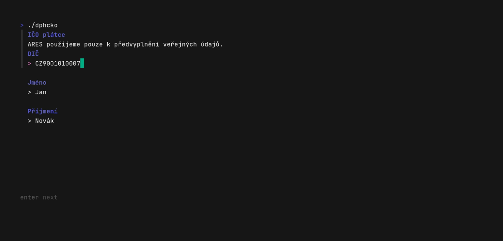
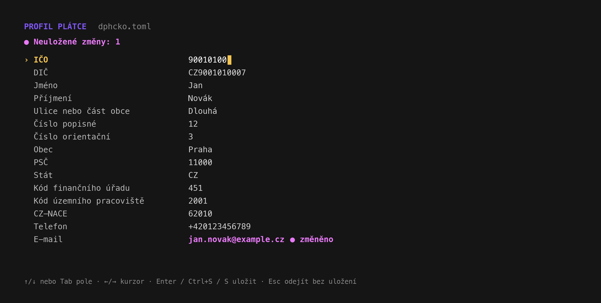
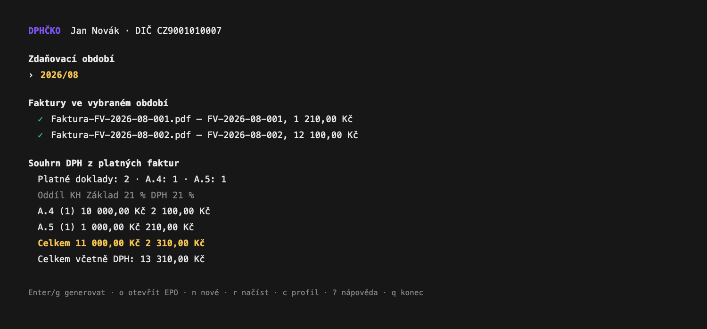
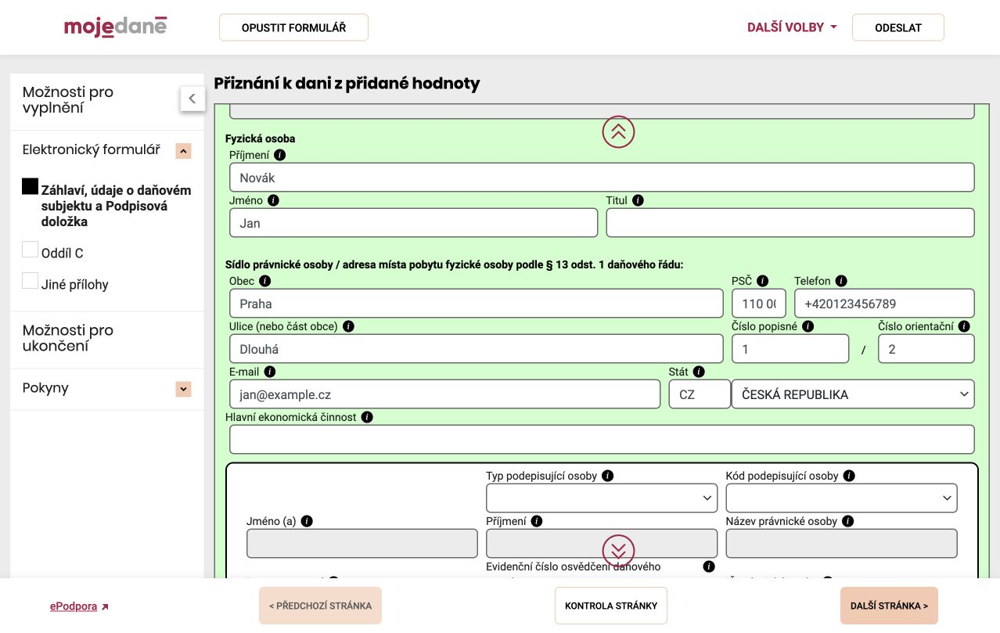
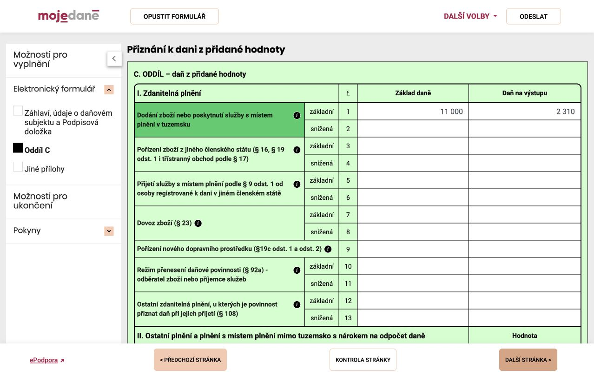
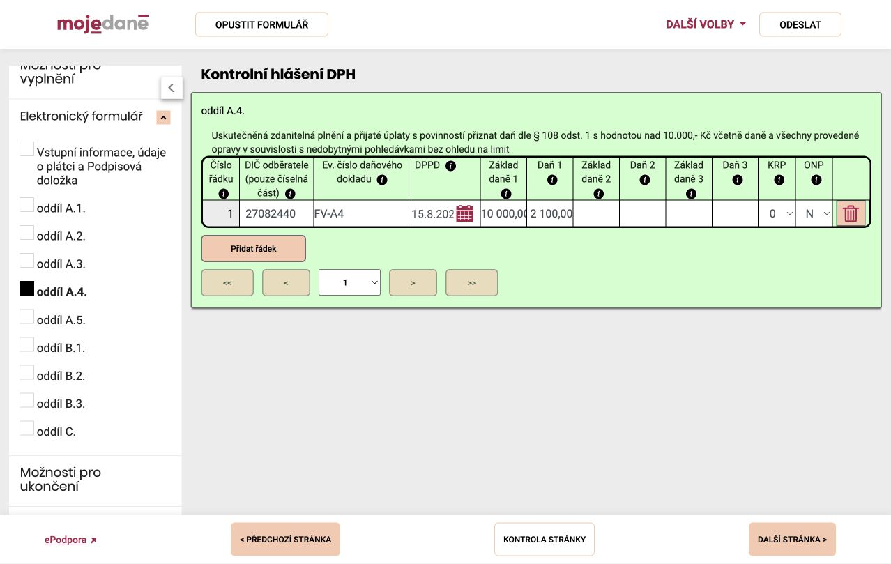

# dphcko

`dphcko` je lokální terminálová aplikace pro přípravu českého přiznání k DPH
(`DPHDP3`) a kontrolního hlášení (`DPHKH1`) z vydaných PDF faktur. Běží jako
jediná binárka bez CGO na macOS, Linuxu a Windows.

> V1 je záměrně úzká: fyzická osoba, měsíční plátce, řádné podání, běžné
> tuzemské vydané faktury v CZK se sazbou 21 %. Neumí přijaté faktury a
> odpočty, dobropisy, zálohy, přenesenou povinnost ani jiné sazby či režimy.

## Funkce

- [x] Jediná lokální binárka bez CGO pro macOS, Linux a Windows.
- [x] Interaktivní terminálové rozhraní ovládané klávesnicí.
- [x] Průvodce prvním spuštěním s předvyplněním veřejných údajů z ARES a
      možností ručního zadání při nedostupnosti služby.
- [x] Lokální profil plátce v čitelném `dphcko.toml` a celoobrazovkový editor,
      který ukáže všechna pole i neuložené změny.
- [x] Zakládání a přepínání měsíčních zdaňovacích období ve složkách `RRRR/MM`.
- [x] Načtení vydaných PDF faktur z QR Faktury nebo QR Platby+F bez OCR a cloudu.
- [x] Kontrola DIČ výstavce, CZK, sazby 21 %, DUZP, částek, duplicit a
      nepodporovaných typů dokladů.
- [x] Automatické rozdělení dokladů do A.4 a A.5 kontrolního hlášení včetně
      hranice 10 000 Kč a potvrzení koncového spotřebitele.
- [x] Generování přiznání `DPHDP3`, kontrolního hlášení `DPHKH1` a čitelného
      textového přehledu za období.
- [x] Kontrolní součty, korunové zaokrouhlení přiznání a zachování haléřů v KH.
- [x] Nulové přiznání za období bez dokladů; prázdné KH se nevytváří.
- [x] Atomický zápis výstupů s omezenými oprávněními a bez odesílání dat mimo
      počítač uživatele.
- [x] Otevření stránky MOJE daně pro ruční načtení vygenerovaných XML.
- [x] Automatické testy, validace proti XSD, CodeQL a multiplatformní buildy
      a release archivy na GitHubu.

## Ukázka

Všechny údaje na snímcích jsou syntetické. Terminálové obrazovky pocházejí
z reálně spuštěné aplikace se dvěma ukázkovými QR Fakturami.

### První nastavení profilu



### Profil a nastavení

Editor ukazuje celý uložený profil najednou. Rozpracované hodnoty barevně
odliší a před uložením je znovu zkontroluje.



### Načtené faktury a ovládání



### Výsledek po načtení do MOJE daně

Následující obrazovky jsou skutečné screenshoty portálu MOJE daně po ručním
načtení testovacích XML se smyšleným plátcem Janem Novákem. Nejde o skutečné
daňové podání a žádný z formulářů nebyl odeslán.







## Použití

1. Stáhněte archiv pro svůj systém z GitHub Releases a rozbalte binárku.
2. V samostatné pracovní složce spusťte `dphcko`.
3. První průvodce načte veřejné údaje podle IČO z [ARES](https://ares.gov.cz/) a nechá je potvrdit.
   Výsledný profil uloží jako viditelný `dphcko.toml` v této složce.
4. Klávesou `n` vytvořte období (předvolený je poslední dokončený měsíc),
   například `2026/08/`, a vložte PDF faktury přímo do této složky.
5. `r` faktury znovu načte a `g` nebo Enter spustí závěrečnou kontrolu a
   generování. Potom otevře ve výchozím prohlížeči obecnou stránku EPO pro
   ruční načtení XML. Klávesa `o` tuto stránku kdykoliv znovu otevře bez
   opakovaného generování. Klávesa `c` otevře celý profil; šipkami nebo Tabem
   se přechází mezi poli, Enter či `Ctrl+S` změny uloží a Esc editor zavře bez
   uložení.

Výstupy vzniknou v `RRRR/MM/vystup/`:

- `DPHDP3_RRRR-MM.xml`
- `DPHKH1_RRRR-MM.xml` (jen když existují podporované doklady)
- `prehled_RRRR-MM.txt`

Aplikace XML nikam automaticky nenahrává, neodesílá ani nepodepisuje. Otevře
pouze stránku [Načtení XML souboru v EPO](https://adisspr.mfcr.cz/dpr/adis/idpr_epo/epo2/uvod/nacteni_souboru.faces),
kde uživatel vybere soubor ze složky `vystup/`. Ve formuláři spusťte kontrolu
a před podáním porovnejte čitelný přehled s evidencí.

## Požadavky na faktury

Každé PDF musí obsahovat čitelnou QR Fakturu, případně QR Platbu+F s vloženým
payloadem `X-INV`. Bez ní se doklad odmítne; aplikace nepoužívá OCR, cloud ani
odhady. Kontroluje DIČ výstavce, CZK, 21% daň, DUZP, součty, duplicity a
podporovaný typ dokladu.

Doklady do 10 000 Kč včetně DPH patří do A.5. Vyšší doklad s DIČ
odběratele patří do A.4. U vyššího dokladu bez DIČ musí uživatel výslovně
potvrdit koncového spotřebitele, jinak se generování zastaví.

## TODO

Náměty pro další verze; pořadí není závazný plán vydání:

- [ ] Přijaté tuzemské faktury, odpočet DPH a odpovídající oddíly B.2/B.3 KH.
- [ ] Dobropisy, vrubopisy a opravy základu nebo výše daně.
- [ ] Zálohové faktury a daňové doklady k přijatým či poskytnutým platbám.
- [ ] Snížená sazba DPH, osvobozená plnění a souběh více sazeb na jednom dokladu.
- [ ] Tuzemský režim přenesení daňové povinnosti.
- [ ] Plnění v EU: dodání a pořízení zboží, služby a souhrnné hlášení.
- [ ] Dovoz, vývoz a další plnění se třetími zeměmi.
- [ ] Faktury v cizích měnách včetně použití správného kurzu.
- [ ] Čtvrtletní zdaňovací období fyzické osoby: volba měsíčního/čtvrtletního
      režimu v profilu, společné zpracování tří měsíců a správné čtvrtletní
      záhlaví v přiznání k DPH i kontrolním hlášení.
- [ ] Právnické osoby.
- [ ] Multiprofil: správa a přepínání více plátců s různými IČO a DIČ.
- [ ] Opravná a dodatečná přiznání a následná kontrolní hlášení.
- [ ] Ruční doplnění dokladu, OCR a import faktur bez QR Faktury.
- [ ] Další vstupní formáty a napojení na fakturační nebo účetní systémy.
- [ ] Přímé bezpečné načtení, podepsání a odeslání podání do EPO.
- [ ] Aktualizace XML schémat a číselníků bez nutnosti nové verze aplikace.

## Vývoj

Je potřeba Go podle `go.mod` a pro validaci golden XML také `xmllint`.

```sh
make verify
```

Schémata EPO jsou v repozitáři jako kontrolované snapshoty:
[DPHDP3 03.01.03](https://adisspr.mfcr.cz/adis/jepo/schema/dphdp3_epo2.xsd) a
[DPHKH1 03.01.14](https://adisspr.mfcr.cz/adis/jepo/schema/dphkh1_epo2.xsd),
obě ze dne 9. 3. 2026. GitHub Actions ověřují testy, XSD a
cross-build pro `darwin/amd64`, `darwin/arm64`, `linux/amd64`, `linux/arm64` a
`windows/amd64`.

Release vznikne standardně pushnutím tagu:

```sh
git tag v0.1.0
git push origin v0.1.0
```

Workflow přes GoReleaser vytvoří pět archivů a `checksums.txt` v GitHub
Releases. Lokálně lze stejnou skladbu ověřit příkazem `make dist`.

## Důležité upozornění

Program je pomůcka, ne daňové poradenství. Záměrně odmítá data mimo popsaný
rozsah. Za úplnost evidence a správnost podání odpovídá uživatel; finální XML
vždy zkontrolujte v aktuálním EPO.
